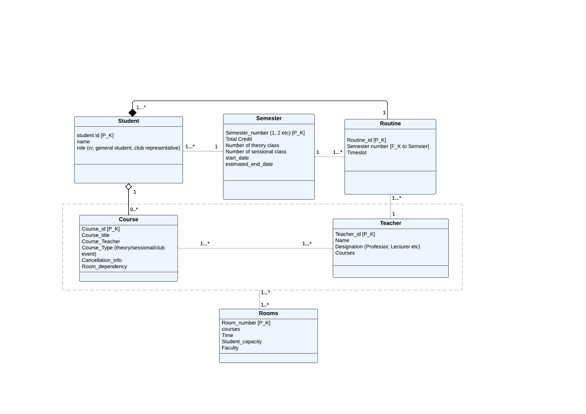
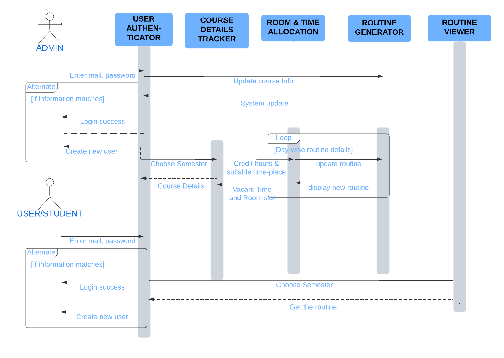

# Schemer
 Schemer is a routine management system that automates university scheduling. It focuses on fixing times, managing classrooms, and finding available rooms, using Relational Database to ensure seamless scheduling and resource allocation.

    

## Features
- **Automated Schedule Generation**
- **Dynamic Schedule Adjustments**
- **Marketing and PR**
- **User Access and Roles**
- **Room Search and Availability**
- **Instructor and Course Management**

## Relational Database Utilization
- **Tables and Relationships**
- **Primary and Foreign Keys**
- **Indexes**
- **Transactions**
- **Views and Stored Procedure**

## RDBMS schema design

  
    
  <em>Schema Design(Entity-Relationship Diagram)</em>
    
   
  
    
  <em>Schema Design(Sequence Diagram)</em>
    

